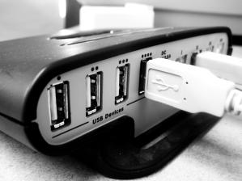

export { default as theme } from './theme'

# UDLT - Universal Distributed Ledger Technology

---

## Proposal in images

Transforms this

---

Designed like 

---

Into

---

## Problems in DLT's:

* Unique "Silver Bullet" style monolith features
* One and only One Asynchronous Cryptographic Keys solution
* Lack of Native flexibility, modularity, pluggability and extension mechanisms
* Any customization needs to be done in scripts or so-called "smart contracts"
* So-called "smart contracts" support a single fixed engine like EVM
* Changes, fixes, and upgrades need to be done by stressful hard forks

---

## UDLT Solution's:

* Well defined Abstractions for modular development, Hot pluggability, and extension mechanisms

* Extensible encoding mechanism for multi-address types using solutions for Asynchronous Cryptographic Keys not limited to:
    1. Bitcoin's secp256k1 
    2. BLS12-381 (Barreto-Lynn-Scott)
    3. Post Quantum Supersingular Isogeny Diffie-Hellman (SIDH)
    4. X.509 (e-CPF / e-CNPJ / others)

---

## UDLT Solution's:

* Pluggable Consensus with native Hybrid Proof of Stake + Proof of QoS

* Network DDOS protection with configurable dynamic Proof of Work

* Multiple, Pluggable and extensible support for virtual machines and serverless computing

* Support for off-chain interactive contracts with on chain settlement

---

import { FullScreenCode } from 'mdx-deck/layouts'

## Product presentation

This is a work in progress MVP and currently features no front-end, the backend node implementation already features:

---

* Post Quantum Supersingular Isogeny Diffie-Hellman Keys

Test cases:

---

* Json RPC and Basic Wallet 

Manual tests with curl:

---

## Network

Network bootstrap

import { Player } from 'video-react'

<Player>
      <source src="assets/network.mp4" />
</Player>